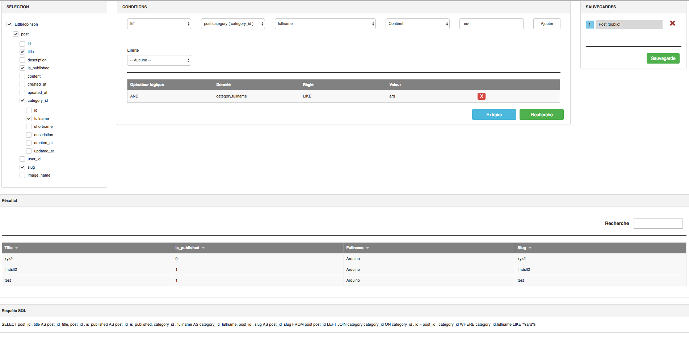
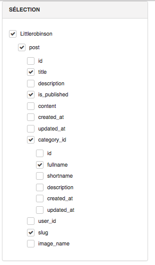
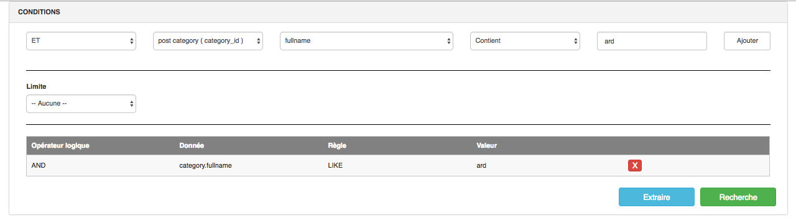
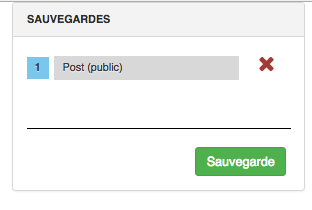
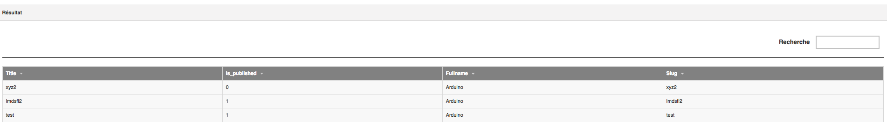
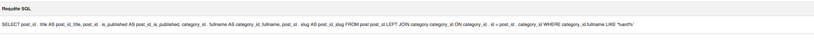
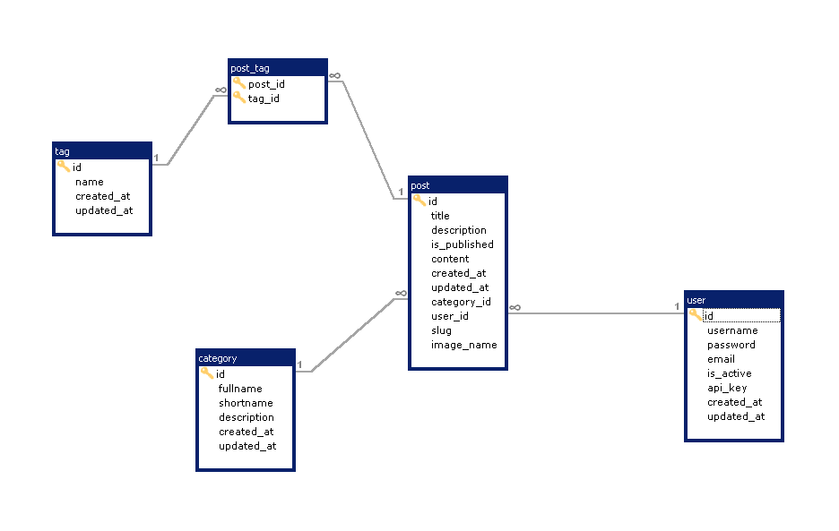

# Query Builder Symfony

Generates queries dynamically on a database.
The tool allows to set up the configuration of a database in a YML file.

A developer can modify certain values ​​in the configuration file to, for example, translate fields from a table.

The applicant Builder takes as input a json file with the fields to request as well as the conditions.
From this file it will construct the query, execute it and return the result.

Screenshots :

 - All blocks
 
 
 
 - Select block
 
 
 
 - Condition block 
  
 
 
 - Save/load queries block 
 
 
 
 - Result block 
 
 
 
 - Query result block 
  


Simple blog Mysql blog structure :



## Installation

### Install the vendor package
```
composer require littlerobinson/query-builder-bundle
```

### Enable the Bundle
```php
// app/AppKernel.php

class AppKernel extends Kernel
{
    public function registerBundles()
    {
        $bundles = array(
            // ...
            new Littlerobinson\QueryBuilderBundle\LittlerobinsonQueryBuilderBundle(),
        );

        // ...
    }
}
```

### Routing 

#### Load the bundle route

```
# /app/config/routing.yml

LittlerobinsonQueryBuilderBundle:
    resource: "@LittlerobinsonQueryBuilderBundle/Resources/config/routing.yml"
    prefix:   /querybuilder
```

#### Or create your own controller and view (with annotation)

```php
# /AppBundle/Controller/YourController.php

/**
 * @Route("/querybuilder", name="query_builder")
 * @return Response
 */
public function indexAction()
{
    return $this->render('LittlerobinsonQueryBuilderBundle:QueryBuilder:query_layout.html.twig', array(
        'queryPath' => '/querybuilder/query' /// Optionnal if you want to change the query route
    ));
}

/**
 * @Method("POST")
 * @Route("/querybuilder/query", name="query_builder_query")
 * @return Response
 */
public function queryAction()
{
    $run = RunQueryBuilder::getInstance($this->container);
    $run->execute();
    return new Response();
}

/**
 * Method for create config file
 * @Method("GET")
 * @Route("/querybuilder/writeconfig", name="query_builder_write_config")
 * @return Response
 */
public function writeDatabaseYamlConfigAction()
{
    $run                           = RunQueryBuilder::getInstance($this->container);
    $_POST['action_query_builder'] = 'write_database_yaml_config';
    $run->execute();
    return new Response();
}
```

### Create the symlink assets.

```
php bin/console assets:install --symlink
```

### Add bundle configuration.
```
# /app/config/config.yml

littlerobinson_query_builder:
    database:
        title: Software name
        is_dev_mode: false
        config_path: database-config.yml
        file_name: querybuilder_db_name
        params:
            driver: pdo_mysql
            host: '%database_host%'
            port: '%database_port%'
            dbname: '%database_name%'
            user: '%database_user%'
            password: '%database_password%'
            charset: utf8mb4    
    user: { name: ~, type: ~ }
    association: { name: ~, type: ~ }
    rules: ~
    security: ~
```

### Configuration with restrictions
```
# /app/config/config.yml

...

user: { name: user_id, type: cookie }
    association: { name: group_id, type: cookie }
    rules: 
        user_id: { type: cookie } 
    security:
        database:
            post: post.user
```

### Set restriction (cookie or session).
```
user_id = 1 OR user_id = [1,2]
```

### Customize the template.

```twig
# /app/Resources/views/index.html.twig



    {{ parent() }}
    <link rel="stylesheet" href="{{ asset('assets/css/dashboard.css') }}"/>



    <div class="query_builder_menu">
        <nav class="navbar navbar-inverse navbar-fixed-top">
            <div class="container-fluid">
                <div class="navbar-header">
                    <button type="button" class="navbar-toggle collapsed" data-toggle="collapse" data-target="#navbar"
                            aria-expanded="false" aria-controls="navbar">
                        <span class="sr-only">Toggle navigation</span>
                        <span class="icon-bar"></span>
                        <span class="icon-bar"></span>
                        <span class="icon-bar"></span>
                    </button>
                    <a class="navbar-brand" href="#">Gestion des inscrits</a>
                </div>
                <div id="navbar" class="navbar-collapse collapse">
                    <ul class="nav navbar-nav navbar-right">
                        <li><a href="{{ path('registrant_index') }}">Accueil</a></li>
                        <li><a href="{{ path('query_builder') }}">Requêteur</a></li>
                        <li><a>{{ app.user.firstName }} {{ app.user.Lastname }}</a></li>
                        <li><a href={{ path('logout') }}>Déconnexion</a></li>
                    </ul>
                </div>
            </div>
        </nav>
    </div>

```

### Extra block.

You can choose to modify or not display the save block and the request block

```twig
# /app/Resources/views/index.html.twig
...

...

...
```

### Change the query path.

```twig
# /app/Resources/views/index.html.twig

    <script>
        let queryPath = '/querybuilder/query';
    </script>

```

### Configuration file

When executing the `writeDatabaseYamlConfig` method it will generate a configuration YAML file with a retro engineering of your database.
You can change :
- table name (_table_translation)
- table visibility (__table_visibility)
- field name (__field_translation)
- field visibility (__field_visibility)

```yaml
category:
    _table_translation: catégorie
    _table_visibility: true
    _primary_key:
        - id
    id:
        name: id
        _field_translation: null
        _field_visibility: true
        type: integer
        default: null
        length: null
        not_null: true
        definition: null
    fullname:
        name: fullname
        _field_translation: nom complet
        _field_visibility: true
        type: string
        default: null
        length: 150
        not_null: true
        definition: null
    shortname:
        name: Nom court
        _field_translation: null
        _field_visibility: true
        type: string
        default: null
        length: 50
        not_null: true
        definition: null
    description:
        name: description
        _field_translation: null
        _field_visibility: true
        type: text
        default: null
        length: null
        not_null: false
        definition: null
    created_at:
        name: created_at
        _field_translation: date de création
        _field_visibility: true
        type: datetime
        default: null
        length: null
        not_null: true
        definition: null
    updated_at:
        name: updated_at
        _field_translation: date de modification
        _field_visibility: true
        type: datetime
        default: null
        length: null
        not_null: true
        definition: null
post:
    _table_translation: article
    _table_visibility: true
    _primary_key:
        - id
    id:
        name: id
        _field_translation: null
        _field_visibility: true
        type: integer
        default: null
        length: null
        not_null: true
        definition: null
    title:
        name: title
        _field_translation: titre
        _field_visibility: true
        type: string
        default: null
        length: 150
        not_null: true
        definition: null
    description:
        name: description
        _field_translation: null
        _field_visibility: true
        type: text
        default: null
        length: null
        not_null: false
        definition: null
    is_published:
        name: is_published
        _field_translation: publié
        _field_visibility: true
        type: boolean
        default: null
        length: null
        not_null: true
        definition: null
    content:
        name: content
        _field_translation: contenu
        _field_visibility: true
        type: text
        default: null
        length: null
        not_null: false
        definition: null
    created_at:
        name: created_at
        _field_translation: date de creation
        _field_visibility: true
        type: datetime
        default: null
        length: null
        not_null: true
        definition: null
    updated_at:
        name: updated_at
        _field_translation: date de modification
        _field_visibility: true
        type: datetime
        default: null
        length: null
        not_null: true
        definition: null
    category_id:
        name: category_id
        _field_translation: catégorie
        _field_visibility: true
        type: integer
        default: null
        length: null
        not_null: false
        definition: null
    user_id:
        name: user_id
        _field_translation: utilisateur
        _field_visibility: true
        type: integer
        default: null
        length: null
        not_null: true
        definition: null
    slug:
        name: slug
        _field_translation: null
        _field_visibility: true
        type: string
        default: null
        length: 150
        not_null: true
        definition: null
    image_name:
        name: image_name
        _field_translation: image
        _field_visibility: true
        type: string
        default: null
        length: 255
        not_null: true
        definition: null
    _FK:
        category_id: { tableName: category, columns: category_id, foreignColumns: id, name: FK_5A8A6C8D12469DE2, options: { onDelete: null, onUpdate: null } }
        user_id: { tableName: user, columns: user_id, foreignColumns: id, name: FK_5A8A6C8DA76ED395, options: { onDelete: null, onUpdate: null } }
post_tag:
    _table_translation: null
    _table_visibility: false
    _primary_key:
        - post_id
        - tag_id
    post_id:
        name: post_id
        _field_translation: null
        _field_visibility: true
        type: integer
        default: null
        length: null
        not_null: true
        definition: null
    tag_id:
        name: tag_id
        _field_translation: null
        _field_visibility: true
        type: integer
        default: null
        length: null
        not_null: true
        definition: null
    _FK:
        post_id: { tableName: post, columns: post_id, foreignColumns: id, name: FK_5ACE3AF04B89032C, options: { onDelete: CASCADE, onUpdate: null } }
        tag_id: { tableName: tag, columns: tag_id, foreignColumns: id, name: FK_5ACE3AF0BAD26311, options: { onDelete: CASCADE, onUpdate: null } }
tag:
    _table_translation: null
    _table_visibility: true
    _primary_key:
        - id
    id:
        name: id
        _field_translation: null
        _field_visibility: true
        type: integer
        default: null
        length: null
        not_null: true
        definition: null
    name:
        name: name
        _field_translation: nom
        _field_visibility: true
        type: string
        default: null
        length: 35
        not_null: true
        definition: null
    created_at:
        name: created_at
        _field_translation: date de création
        _field_visibility: true
        type: datetime
        default: null
        length: null
        not_null: true
        definition: null
    updated_at:
        name: updated_at
        _field_translation: date de modification
        _field_visibility: true
        type: datetime
        default: null
        length: null
        not_null: true
        definition: null
user:
    _table_translation: utilisateur
    _table_visibility: true
    _primary_key:
        - id
    id:
        name: id
        _field_translation: null
        _field_visibility: true
        type: integer
        default: null
        length: null
        not_null: true
        definition: null
    username:
        name: username
        _field_translation: null
        _field_visibility: true
        type: string
        default: null
        length: 50
        not_null: true
        definition: null
    password:
        name: password
        _field_translation: null
        _field_visibility: false
        type: string
        default: null
        length: 64
        not_null: true
        definition: null
    email:
        name: email
        _field_translation: null
        _field_visibility: true
        type: string
        default: null
        length: 60
        not_null: true
        definition: null
    is_active:
        name: is_active
        _field_translation: actif
        _field_visibility: true
        type: boolean
        default: null
        length: null
        not_null: true
        definition: null
    api_key:
        name: api_key
        _field_translation: false
        _field_visibility: true
        type: string
        default: null
        length: 255
        not_null: true
        definition: null
    created_at:
        name: created_at
        _field_translation: date de creation
        _field_visibility: true
        type: datetime
        default: null
        length: null
        not_null: true
        definition: null
    updated_at:
        name: updated_at
        _field_translation: date de modification
        _field_visibility: true
        type: datetime
        default: null
        length: null
        not_null: true
        definition: null
```

### Security

Add this in the config.yml file to tell the program where to find the restriction value.

```yaml
# config.yml
user: { name: user, type: cookie }
association: { name: group, type: cookie }
rules:
    user: { type: cookie }
security:
    database:
        post: post.user
        category: category.post.user
...
```

Or like this with no rules.

```yaml
# config.yml
user: { name: ~, type: ~ }
association: { name: ~, type: ~ }
rules: ~
security: ~
...
```
### Request

When you execute a request it will generate a json value representing the query.

```json

{  
   "from":{  
      "post":{  
         "id":"id",
         "title":"title",
         "category_id":{  
            "id":"id",
            "fullname":"fullname"
         }
      }
   },
   "where":[  
      {  
         "AND":{  
            "category.fullname":{  
               "LIKE":[  
                  "prog"
               ]
            }
         }
      }
   ],
   "limit":0,
   "offset":0
}
```

### Output

```mysql
SELECT
  post_id.id AS post_id_id,
  post_id.title AS post_id_title,
  category_id.id AS category_id_id,
  category_id.fullname AS category_id_fullname
FROM
  post post_id
  LEFT JOIN category category_id
    ON category_id.id = post_id.category_id
WHERE category_id.fullname LIKE '%prog%'
```

### Tests
```
phpunit --bootstrap vendor/autoload.php  tests/
```

### IHM

IHM is cutting in 3 zones :
- appRequest : It's a parent zone for making the request.
 It's include 2 - zones :
    - SelectItem : zon of selecting table and rows
    - ConditionItem : Zone to build request conditions
    - SpreadSheet : Zone for showing research result with grid table

Javascript Variables list in appRequest :
- dbObj : object representation of the JSON database configuration
- foreignTables : List of foreign tables
- items : Object representation of selectable table and rows with checked status and traduction name
- from : Object representing from request (for json query)
- where : Object representing where request (for json query)
- conditions : Array of objects representing conditions request
- columns : column result list with translation
- data : result data 
- jsonQuery : json query 
- sqlRequest : request query
